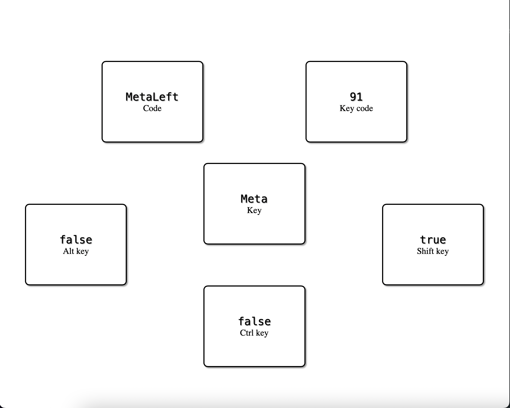

# Key Data

## Aplicación sencilla para obtener información acerca de cualquier tecla presionada

- Da información de cualquier tecla presionada
    - Key - La tecla presionada
    - Code - Código de la tecla presionada
    - Key code - Código númerico de la tecla presionada, normalmente es el decimal del código ASCII
    - Alt key - Nos dice si se presionó la tecla *alt*
    - Shift key - Nos dice si se presionó la tecla *shift*
    - Ctrl key - Nos dice si se presionó la tecla *ctrl*

- Contiene animaciones para saber cuando se ha presionado una tecla y que por lo tanto la información mostrada podría haber cambiado

